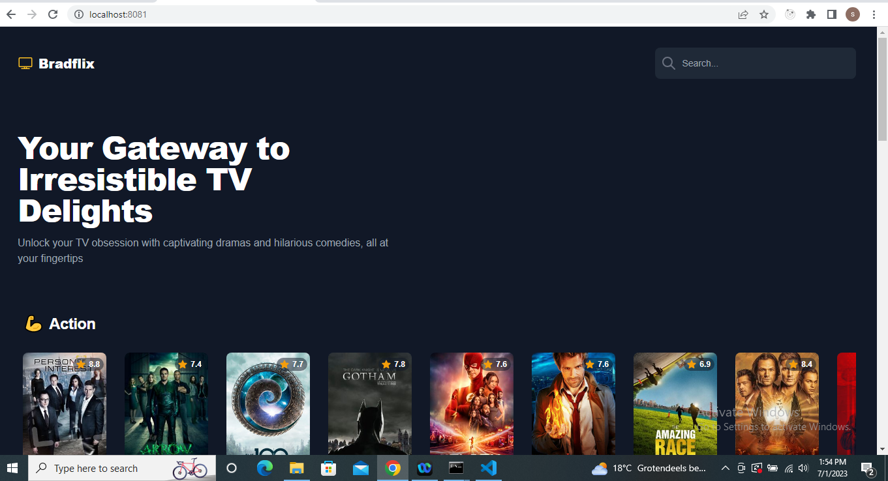
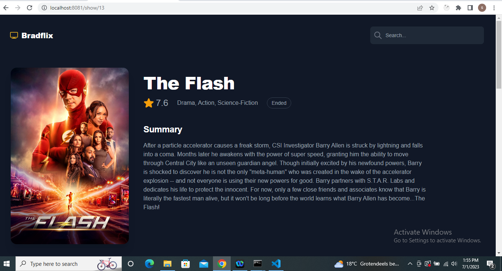
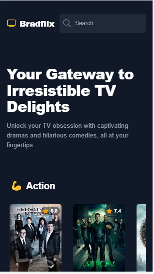
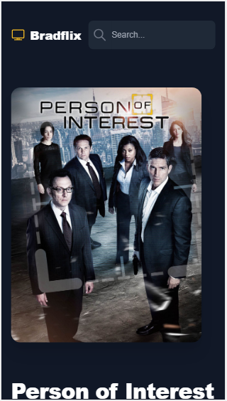

# Bradflix

TV shows application that allows users to view a few lists(preferable horizontal list) of TV shows based on different genres (drama, comedy, sports, etc.).

## Features

Browse and search for movies
See the movie details

## Installation

Clone the repository

Navigate to the project directory

Install the dependencies

`$ npm install`

Start the development server

`$ npm run serve`

## Built With

VueJS (2.6.11) - JavaScript framework for building user interfaces
vue-router (3.6.5) - Router for Vue js
tailwindcss - Open source CSS framework which provides utility CSS classes
API - https://api.tvmaze.com

## Screenshots

